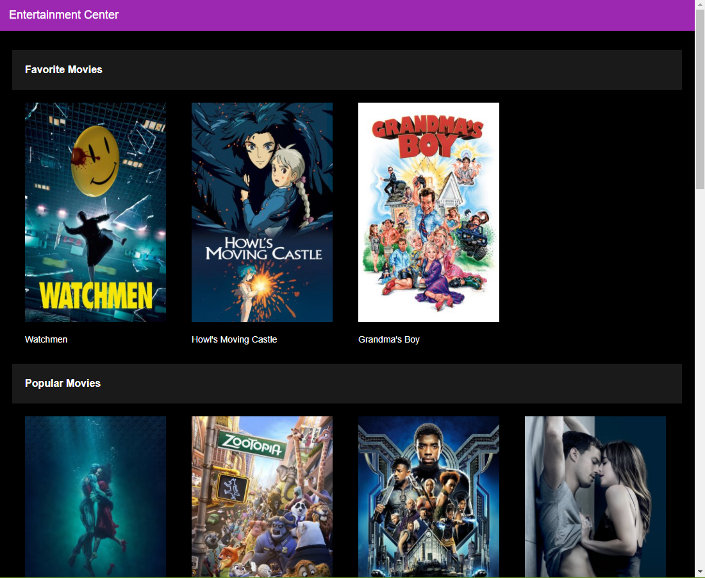
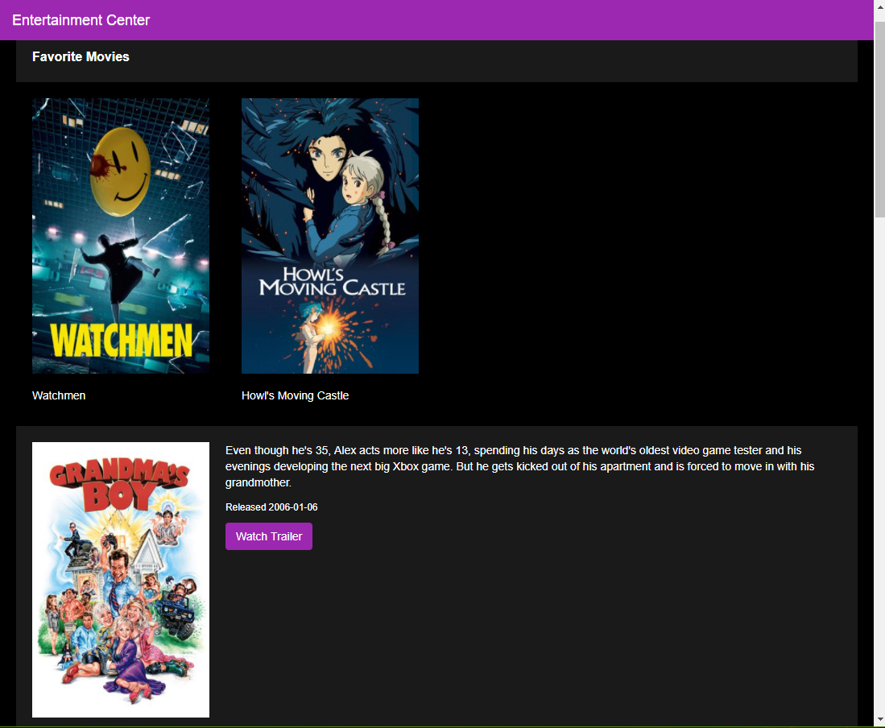
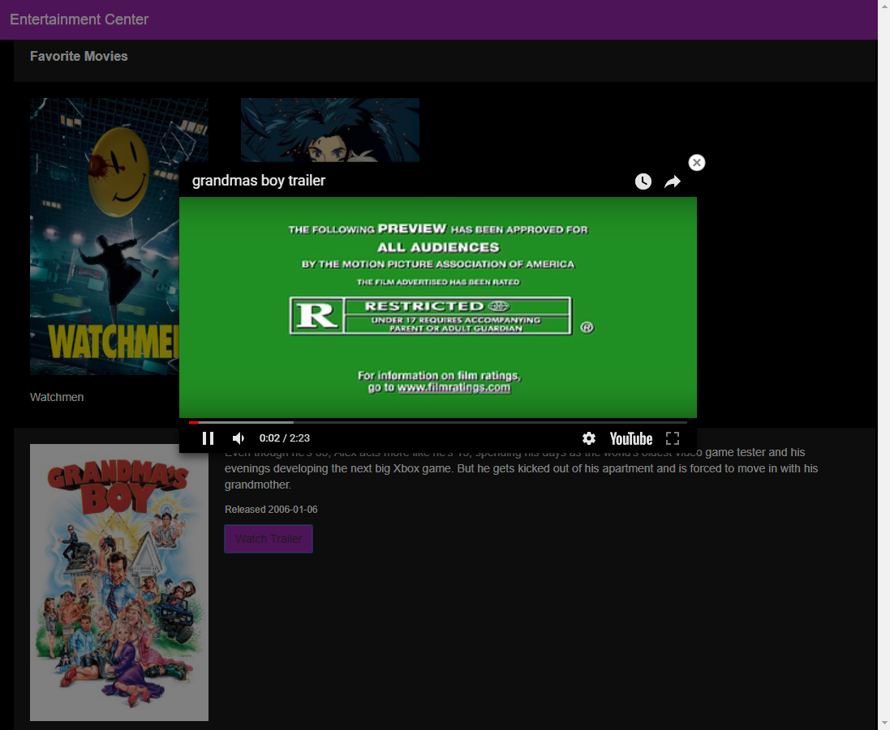

# Udacity Project - Movie Trailer Website

This is my project submission for the Udacity Fullstack Developer Nanodegree,
Fundamentals module.

## What does it do?

 - Make a list of static Movie instances containing title, overview, youtube_url and release date 
 - Get a list of popular movies from TMDB and convert to Movie instances
 - Render the HTML to display the list of movies
 - Open a browser to display the HTML


## Install & Run

Clone this repository:
```
git clone https://github.com/christiaan-lombard/udacityproject-movie-trailer-website
```

Go to the project root:
```
cd .\udacityproject-movie-trailer-website
```

Run the __init__ Python file:
```
python .\src\__init__.py
```

## Screenshots






## Resources

 - [TMDb: Movie Database API](https://www.themoviedb.org/documentation/api)
 - [TMDb: API Docs](https://developers.themoviedb.org/3/getting-started/introduction)


## Udacity Project Specifications

### Project Overview

You will write server-side code to store a list of your favorite movies, including box art imagery and a movie trailer URL. You will then use your code to generate a static web page allowing visitors to browse their movies and watch the trailers.

### Project Display Example

The Movie Trailer Website project consists of server-side code to store a list of movies titles, along with its respective box art imagery and movie trailer website. The data should be served as a web page allowing visitors to review the movies and watch the trailers:


*Simple home page where movies are laid out*


### How will I complete this project?

 1. Install Python
 1. Create a data structure (i.e. a Python Class) to store your favorite movies, including movie title, box art URL (or poster URL) and a YouTube link to the movie trailer.
 1. Create multiple instances of that Python Class to represent your favorite movies; group all the instances together in a list.
 1. To help you generate a website that displays these movies, we have provided a starter code repository that contains a Python module called fresh_tomatoes.py. To get started, fork this repository to create your own copy in GitHub. Then clone your ud036_StarterCode repository to work on this project locally on your computer. The fresh_tomatoes.py module has a function called open_movies_page that takes in one argument, which is a list of movies, and creates an HTML file which will display all of your favorite movies.
 1. Ensure your website renders correctly when you attempt to load it in a browser.

 #### Notes

 - The file fresh_tomatoes.py contains the open_movies_page() function that will take in your list of movies and generate an HTML file including this content, producing a website to showcase your favorite movies.
 - Your task is to write a movie class in media.py. To do this, think about what the properties of a movie are that need to be encapsulated in a movie object such as movie titles, box art, poster images, and movie trailer URLs. Look at what open_movies_page() does with a list of movie objects for hints on how to design your movie class.
 - You’ll want to write a constructor for the movie class so that you can create instances of movie. You can now create a list of these movie objects in entertainment_center.py by calling the constructor media.Movie() to instantiate movie objects. You’ve given movies their own custom data structure by defining the movie class and constructor, and now these objects can be stored in a list data structure. This list of movies is what the open_movies_page() function needs as input in order to build the HTML file, so you can display your website.